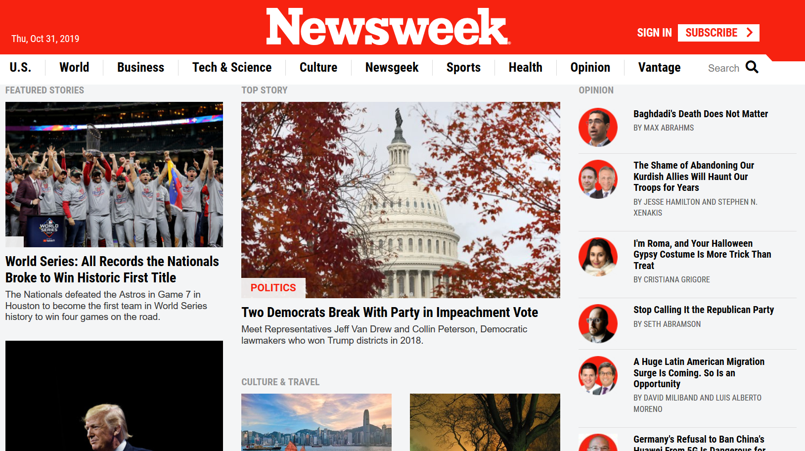

# Working-with-Bootstrap

<!-- PROJECT LOGO -->
 

  

  <h3 align="center">NewsWeek Clone Project</h3>

## Project preview: 
 

  <a href="https://raw.githack.com/leonmezu1/Working-with-bootstrap-4-Microverse-Project/Beta/index.html">https://raw.githack.com/leonmezu1/Working-with-bootstrap-4-Microverse-Project/Beta/index.html</a>

<!-- ABOUT THE PROJECT -->
# About The Project

Bootstrap 4 Framework it's a powerful tool that helps web developers to build amazing projects accelerating coding by preprocessing styling, positioning and behavior utilities in classes hosted in the framework allowing also keep CSS 3 style sheet minimized.

That's why a good way to learn how to use this framework it's building a replica of a site that actually uses it.

[-NewsWeek](https://www.newsweek.com/)

## Project objectives

* Build a replica of the NewsWeek webpage ensuring it looks and behaves like the original one.
* Use Bootstrap CSS classes wherever it is possible.
* Ensure the replica satisfies responsive behavior.

## Skills to use and requirements:

Identify the breakpoint points used in the original page, align elements with float or flex and grids, use background images, and elements positioning.

## Constraints

MUST: use of linterns, Bootstrap CSS classes, follow CSS best practices, use of CSS Reset, use W3c validation services.

### Built With

* [Bootstrap](https://getbootstrap.com)
* [VanillaJavascript](http://vanilla-js.com/)

<!-- CONTACT -->
## Contact

Leonardo Mezu: [ @leonmezu](https://twitter.com/leonmezu) - leo7xs@gmail.com

Project Link: [https://github.com/leonmezu1/Working-with-bootstrap-4-Microverse-Project](https://github.com/leonmezu1?tab=repositories)

<!-- LICENSE -->
## License

Distributed under the MIT License. See `LICENSE` for more information.

